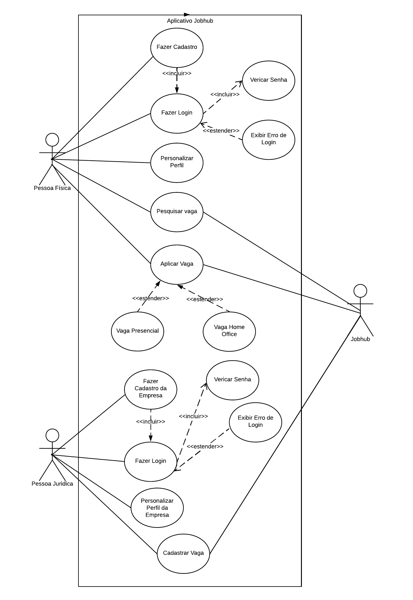

# Especificações do Projeto

A especificação precisa do desafio e dos aspectos mais significativos a serem abordados neste projeto foi solidificada por meio da colaboração dos usuários, através de um processo imersivo conduzido pela equipe. Esse processo envolveu a observação dos usuários em seus ambientes cotidianos e a realização de entrevistas. Os insights e informações obtidos durante essa etapa foram organizados na forma de personas e histórias de usuários, proporcionando uma compreensão mais profunda das necessidades e expectativas do público-alvo. Essa abordagem centrada no usuário servirá como base para o desenvolvimento da solução, assegurando que os principais requisitos sejam abordados de maneira eficaz e alinhada às demandas reais dos usuários. 

## Personas
A ideia de criar uma plataforma que satisfaça o maior número de usuários distintos entre si é, ao primeiro ver, a forma mais lógica de se alcançar uma plataforma bem-sucedida. Entretanto, para COOPER e al. (2014) essa lógica está fadada ao fracasso, uma vez que tentar criar algo que agrade a todos têm como resultado algo que não agrada ninguém. E para evitar isso, criamos as chamadas “personas”, que são representações de usuários fictícios, mas que agrupam as motivações, comportamentos (COOPER e al., 2014) e necessidades reais do nosso público-alvo.

As personas levantadas durante o processo de entendimento do problema são apresentadas nas figuras que se seguem.

|            | Vinicius Oliveira                       | Cristiane Souza                        | Débora Peixoto                       | Wagner Silva                        | Thiago Melo                       | 
|------------|------------------------------------------|----------------------------------------|---------------------------------------|-------------------------------------|-------------------------------------|
|            |  |  |  |  |  |
| Idade      | 24                                       | 30                                    | 25                                   | 40                                  | 45                                  |
| Ocupação   | Recém-formado em Engenharia Civil        | Desenvolvedora C#                     | Recrutadora de RH                    | Dono de Restaurante                 | Dono de uma Concessionária                 |
| Aplicativos| Instagram, Facebook, Whatsapp            | TikTok, Youtube                       | Whatsapp, Threads                    | Ifood, Instagram                    | Whatsapp, Instagram                    |
| Motivações | Inicialização no mercado de trabalho, Ascensão de carreira | Desenvolvimento profissional, Realização de metas pessoais | Em busca de pessoas competentes, Se destacar como recrutadora | Ampliar seu restaurante, Ter um fluxo de atendimento melhor | Ser lider de mercado, Atendimento diferenciado e eficaz |
| Frustrações| Competição acentuada, Expectativas Irrealistas | Dificuldade de encontrar empregos relevantes, Pressão social | Dificuldade de achar perfis que a empresa procura, Dificuldade em compilar perfis | Não achar mão de obra qualificada | Fidelização de clientes |
| Hobbies    | Jogar videogame, Passear com a família   | Tecnologia, Viagens                   | Culinária, Assistir Séries e Filmes   | Cozinhar, Corridas                  | Viagem, Leitura                 |

## Histórias de Usuários

Com base na análise das personas forma identificadas as seguintes histórias de usuários:

|EU COMO... `PERSONA`| QUERO/PRECISO ... `FUNCIONALIDADE` |PARA ... `MOTIVO/VALOR`                 |
|--------------------|------------------------------------|----------------------------------------|
|Vinicius Oliveira  | Visualizar vagas de emprego da minha área            | Candidatar para uma vaga                 |
|Vinicius Oliveira  | Cadastrar Currículos            | Para receber propostas de emprego                 |
|Cristiane Souza       | Poder realizar uma pesquisa sobre vagas de Analista de sistemas                 | Manter atualizada sobre o mercado |
|Cristiane Souza       | Encontrar uma empresa grande com o foco em C#                 | Achar uma vaga melhor em sua especialização |
|Débora Peixoto       | Publicar vagas de emprego                 | Para receber currículos |
|Débora Peixoto       | Filtrar possíveis candidatos                 | Analisar o melhor perfil |
|Wagner Silva       | Achar um bom profissional                 | Analisar o melhor perfil |
|Wagner Silva       | Um site intuitivo para publicar suas vagas                 | Tem dificuldade em divulgar suas ofertas de trabalho |
|Thiago Melo       | Achar vendedores qualificados                 | Para Melhorar o Atendimento |
|Thiago Melo       | Um site intuitivo para publicar suas vagas                 | Analisar o melhor perfil |
## Requisitos

As tabelas que se seguem apresentam os requisitos funcionais e não funcionais que detalham o escopo do projeto.

### Requisitos Funcionais

|ID    | Descrição do Requisito                                               | Prioridade |
|------|-----------------------------------------------------------------------|------------|
|RF-01 | O site deve conter um sistema de cadastro e login do usuário          | ALTA       |
|RF-02 | O usuário deve conseguir personalizar seu perfil                      | MÉDIA      |
|RF-03 | O usuário deve conseguir aplicar seu currículo em vagas disponíveis   | ALTA       |
|RF-04 | O site deve apresentar uma lista de vagas na página principal         | ALTA       |
|RF-05 | O usuário deve ter opções de filtro para a pesquisa de vagas         | ALTA       |
|RF-06 | O usuário deve conseguir divulgar seu currículo                       | ALTA       |
|RF-07 | O usuário deve conseguir compartilhar a vaga                          | BAIXA      |
|RF-08 | O usuário empregador deve poder criar vagas                           | ALTA       |
|RF-09 | O usuário empregador poderá visualizar currículos cadastrados a sua vaga | ALTA       |
|RF-10 | O site deve conter um sistema de cadastro e login do usuário empregador| ALTA       |
|RF-11 | O usuário empregador deve conseguir personalizar o perfil da empresa  | MÉDIA      |

### Requisitos não Funcionais

|ID     | Descrição do Requisito                                             | Prioridade |
|-------|--------------------------------------------------------------------|------------|
|RNF-01 | O site deverá ser responsivo permitindo a visualização em um celular de forma adequada | Alta    |
|RNF-02 | O site deve ter bom nível de contraste entre os elementos da tela em conformidade | Média |
|RNF-03 | O site deve ser compatível com os principais navegadores do mercado (Google Chrome, Firefox, Microsoft Edge) | Alta |
|RNF-04 | O site deve estar em pleno funcionamento 24 horas por dia, 7 dias por semana, garantindo acesso ininterrupto aos usuários e proporcionando informações atualizadas e confiáveis a qualquer momento. | Alta |
|RNF-05 | O site deve ser publicado em um ambiente acessível publicamente na Internet (Repl.it, Github Pages, Heroku); | Alta |
|RNF-06 | O sistema deve seguir práticas de UI e UX                          | Alta       |
|RNF-07 | O sistema deve ser de fácil manutenção                              | Alta       |

## Restrições

|ID | Restrição                                                                                         |
|-- |----------------------------------------------------------------------------------------------------|
|01 | O projeto deverá ser entregue no final do semestre letivo, não podendo extrapolar a data de 06/12/2023.|
|02 | A equipe não pode subcontratar o desenvolvimento do trabalho.                                      |
|03 | O aplicativo deve se restringir às tecnologias básicas e atualizadas                               |
|04 | É necessário realizar o envio constante de atualizações acerca do projeto para o professor orientador.|
|05 | O projeto deve comportar sua aplicação no Windows ou Linux.                                        |
|06 | É necessário que o projeto possua todos os requisitos de aplicação antes alinhados com o professor orientador.|

## Diagrama de Casos de Uso

