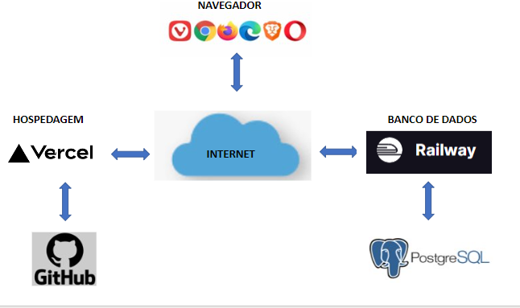

# Arquitetura da Solução

Pré-requisitos: <a href="3-Projeto de Interface.md"> Projeto de Interface</a>

## Diagrama de Classes

## Modelo ER (Projeto Conceitual)

## Projeto da Base de Dados

## Tecnologias Utilizadas

### 1. Linguagens de Programação e Desenvolvimento Web

- **C# (C Sharp):** 
  - Uma linguagem de programação orientada a objetos, desenvolvida pela Microsoft, que será usada como a linguagem principal para a lógica de back-end da aplicação.

- **ASP.NET Core MVC:** 
  - É um framework para desenvolvimento web da Microsoft que permite a criação de aplicativos web escaláveis e de alto desempenho. "MVC" refere-se ao padrão Model-View-Controller, que separa a lógica de aplicação em três componentes interconectados, facilitando o gerenciamento e a manutenção.

- **HTML:** 
  - Linguagem de marcação utilizada para estruturar o conteúdo da página.

- **CSS:** 
  - Estilo de folha de estilo usado para definir a aparência visual das páginas web.

- **JavaScript:** 
  - Linguagem de programação usada para tornar as páginas web dinâmicas e interativas.

### 2. Banco de Dados

- **PostgreSQL:** 
  - Sistema de gerenciamento de banco de dados relacional objeto (ORDBMS) open-source. Será usado para armazenar e recuperar os dados da aplicação.

### 3. Plataformas de Implantação (Deploy)

- **Vercel:** 
  - Plataforma de nuvem para hospedagem e implantação de aplicativos frontend e serverless. Será usado para implantar o lado frontend (HTML, CSS, JavaScript) e talvez o backend (dependendo da configuração).

- **Railway:** 
  - Uma plataforma para implantação de aplicativos e gerenciamento de banco de dados. Neste contexto, será usado principalmente para hospedar e gerenciar o banco de dados PostgreSQL.

### 4. Ambiente de Desenvolvimento Integrado (IDE)

- **Visual Studio 2022:** 
  - IDE da Microsoft que suporta desenvolvimento em várias linguagens, incluindo C#. Ele oferece uma variedade de ferramentas para facilitar o desenvolvimento, teste e depuração de aplicativos. Será a principal ferramenta de desenvolvimento para o projeto.

## Hospedagem

O site utiliza a ferramenta Vercel pelo domínio vercel.app como ambiente de hospedagem do site do projeto, disponibilizado gratuitamente pelo próprio github. E Railway - PostgreSQL para a hospedagem do banco de dados.
