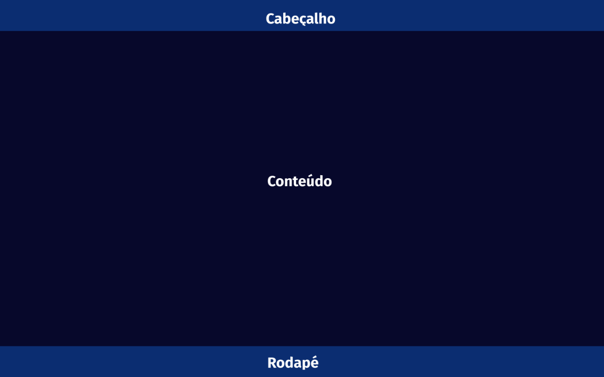

# Template Padrão da Aplicação

Layout padrão do site (HTML e CSS) que será utilizado em todas as páginas com a definição de identidade visual, aspectos de responsividade e iconografia.

O template criado está disponível [aqui](https://github.com/ICEI-PUC-Minas-PMV-ADS/pmv-ads-2023-1-e1-proj-web-t10-futscore/blob/main/src/Layout.html) e é composto pelos seguintes
layouts:
- Cabeçalho
- Conteúdo de cada página
- Rodapé

Todas as paginas do site são responsivas.

## Cabeçalho

O cabeçalho do site apresenta o logotipo e os botões de navegação para as diferentes páginas do site.

## Conteúdo

Essa seção será dedicada ao conteúdo de cada página. Por exemplo, na página Home, será exibida uma lista com varias vagas. Cada página terá um conteúdo específico relacionado ao seu propósito, como criação de vaga, perfil, entre outros.

## Rodapé

No rodapé do site, uma seção de direitos autorais (copyright).
