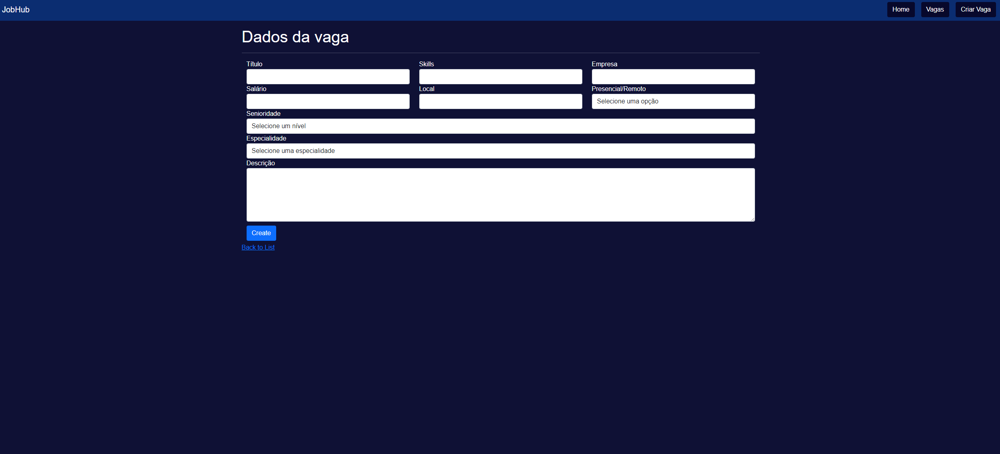
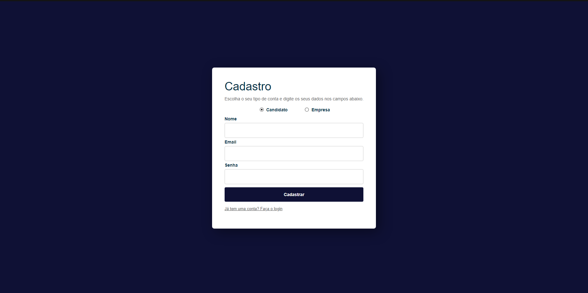
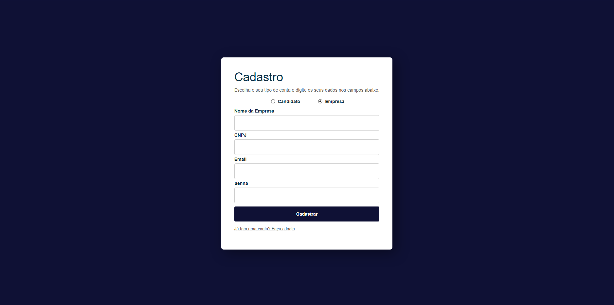

# Programação de Funcionalidades

Nesta seção são apresentadas as telas desenvolvidas para cada uma das funcionalidades
do sistema. O respectivo endereço (URL) e outras orientações de acesso são são
apresentadas na sequência.

## 1. HOMEPAGE (RF-04)

Nesta sesssão, o usuario, assim que abrir verá a lista de vagas disponiveis no momento.
|ID    | Descrição do Requisito  | Artefato(s) produzido(s) |
|------|-----------------------------------------|----|
|RF-004| O site deve apresentar uma lista de vagas na página principal | HomeController.cs / Index.cs.html / Vaga.cs | 

## 2. CRIAR VAGA (RF-06)

Nesta sessão, a empresa poderá criar a vaga.
|ID    | Descrição do Requisito  | Artefato(s) produzido(s) |
|------|-----------------------------------------|----|
|RF-006| O usuário empregador deve poder criar vagas| VagaController.cs / Vaga.cs / Categoria.cs / CreateVaga.cshtml | 

## 3. EXCLUIR VAGA (RF-07)

Nesta sessão, a empresa verá as vagas criadas e poderá excluí-las.
|ID    | Descrição do Requisito  | Artefato(s) produzido(s) |
|------|-----------------------------------------|----|
|RF-007| O usuário empregador deve poder excluir vagas | VagaController.cs / VagaRepository.cs / CategoriaRepository.cs / List.cshtml | 

## 4. EDITAR VAGA (RF-08)

Nesta sessão, a empresa poderá editar a vaga já criada.
|ID    | Descrição do Requisito  | Artefato(s) produzido(s) |
|------|-----------------------------------------|----|
|RF-008| O usuário empregador deve poder editar vagas | VagaController.cs / VagaRepository.cs / CategoriaRepository.cs / Edit.cshtml | 

## 5. CADASTRO E LOGIN DO USUÁRIO (RF-01)

Nesta sessão, o usuário candidato poderá realizar seu login ao preencher os requisitos. Caso não tenha uma conta cadastrada, basta clicar na frase "Não tem uma conta? Cadastre-se".

Ao clicar na frase, o usuário candidato poderá realizar seu cadastro ao preencher os requisitos solicitados. 
|ID    | Descrição do Requisito  | Artefato(s) produzido(s) |
|------|-----------------------------------------|----|
|RF-001| O site deve conter um sistema de cadastro e login do usuário | UsuariosController.cs / Usuario.cs / Login.cshtml / Create.cshtml | 

## 6. CADASTRO E LOGIN DO USUÁRIO EMPREGADOR (RF-10)

Nesta sessão, o usuário empregador poderá realizar seu login ao preencher os requisitos. Caso não tenha uma conta cadastrada, basta clicar na frase "Não tem uma conta? Cadastre-se".

Ao clicar na frase, o usuário empregador poderá realizar seu cadastro ao preencher os requisitos solicitados. 
|ID    | Descrição do Requisito  | Artefato(s) produzido(s) |
|------|-----------------------------------------|----|
|RF-010| O site deve conter um sistema de cadastro e login do usuário empregador | UsuariosController.cs / Usuario.cs / Login.cshtml / Create.cshtml | 

## 7. FILTRO DE PESQUISA (RF-05)

Nesta sessão, a empresa poderá utilizar filtros de pesquisa ao clicar em "Modo de trabalho" e/ou "Senioridade", após isso as opções de filtro aparecerão. Para obter resultado basta clicar no botão "Pesquisar" logo abaixo. 
|ID    | Descrição do Requisito  | Artefato(s) produzido(s) |
|------|-----------------------------------------|----|
|RF-005| O usuário deve ter opções de filtro para a pesquisa de vagas | Categoria.cs / VagaRepository.cs / VagaListViewModel.cs | 

## Requisitos em Desenvolvimento
|ID    | Descrição do Requisito  | Artefato(s) produzido(s) |
|------|-----------------------------------------|----|
|RF-002| O usuário deve conseguir personalizar seu perfil    | Em desenvolvimento |
|RF-003| O usuário deve conseguir aplicar seu currículo em vagas disponíveis | Em desenvolvimento | 
|RF-009| O usuário empregador poderá visualizar currículos cadastrados a sua vaga | Em desenvolvimento | 
|RF-011| O usuário empregador deve conseguir personalizar o perfil da empresa | Em desenvolvimento | 

