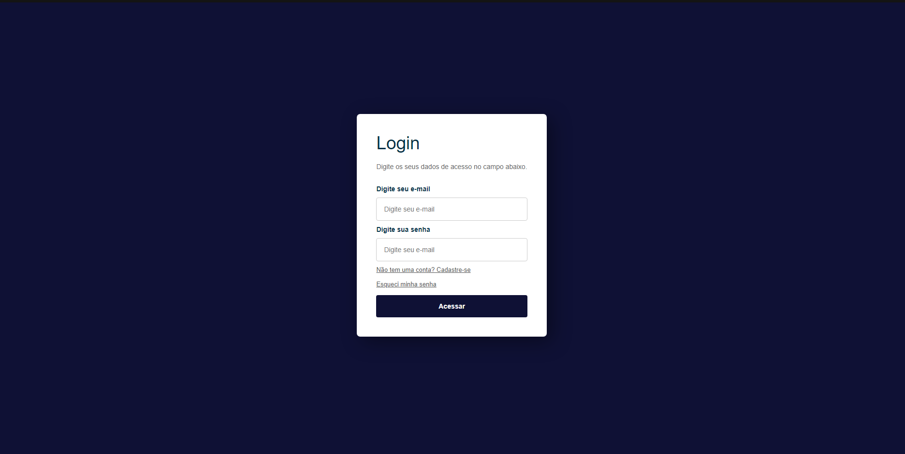
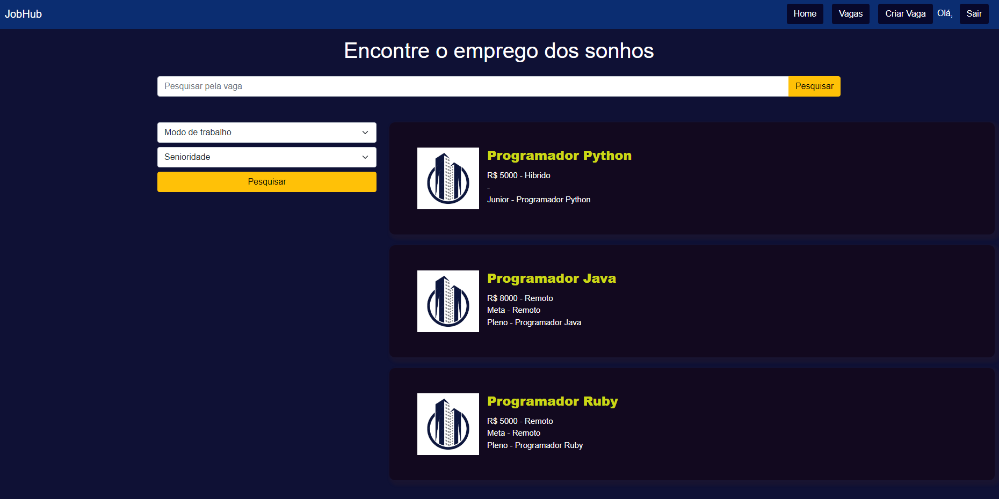

# Registro de Testes de Software

# CT-01 - Cadastro Candidato

Resultado: Ao clicar na opção "Cadastre-se" a página será direcionada para o formulário de cadastro. Ao selecionar a opção "Candidato", irão aparecer campos de preenchimento de informações que serão necessários para realizar o cadastro como candidato. Após preenchidos adequadamente, clicar no botão "Cadastrar" para finalizar. 

# CT-02 - Efetuar Login

Resultado: Ao clicar no botão "Login" no cabeçalho, a página será direcionada para a sessão de login. Aparecerão campos de preenchimento necessários para efetuar o Login e após preenchidos clicar no botão "Acessar" para finalizar.

# CT-04 - Pesquisa de vaga

Resultado: Ao clicar na barra de pesquisa escrito "Pesquisar pela vaga" o usuário poderá pesquisar por uma vaga utilizando palavras chave. Ao clicar nas opções "Modo de Trabalho" e/ou "Senioridade" uma lista para filtros de pesquisa aparecerá de acordo com o tipo de cada opção, e assim que o usuário fizer suas escolhas ele precisará clicar no botão "Pesquisar" logo abaixo para que a pesquisa com filtros seja concluída. 

# CT-06 - Cadastro Empresa

Resultado: Ao clicar na opção "Cadastre-se" a página será direcionada para o formulário de cadastro. Ao selecionar a opção "Empresa", irão aparecer campos de preenchimento de informações que serão necessários para realizar o cadastro como empregador. Após preenchidos adequadamente, clicar no botão "Cadastrar" para finalizar. 

# CT-07 - Criação da Vaga com Sucesso

Resultado: Ao clicar no botão criar vaga, irá abrir uma nova pagina onde deverão ser preenchidos todos  os campos ( Título, Skills, Empresa, salário, local, presencial/remoto, nível de senioridade, especialidade, descrição da vaga,) e após isso Clicar no botão "Criar vaga".

# CT-08 – Editar a Vaga

Resultado: Ao clicar no botão "Editar", irá abrir uma nova pagina onde poderar ser trocado os todos  os campos ( Título, Skills, Empresa, salário, local, presencial/remoto, nível de senioridade, especialidade, descrição da vaga,) e após isso Clicar no botão "Editar".

# CT-09 – Deletar a Vaga

Resultado: Ao clicar no botão "Excluir", deverá excluir a vaga desejada.
