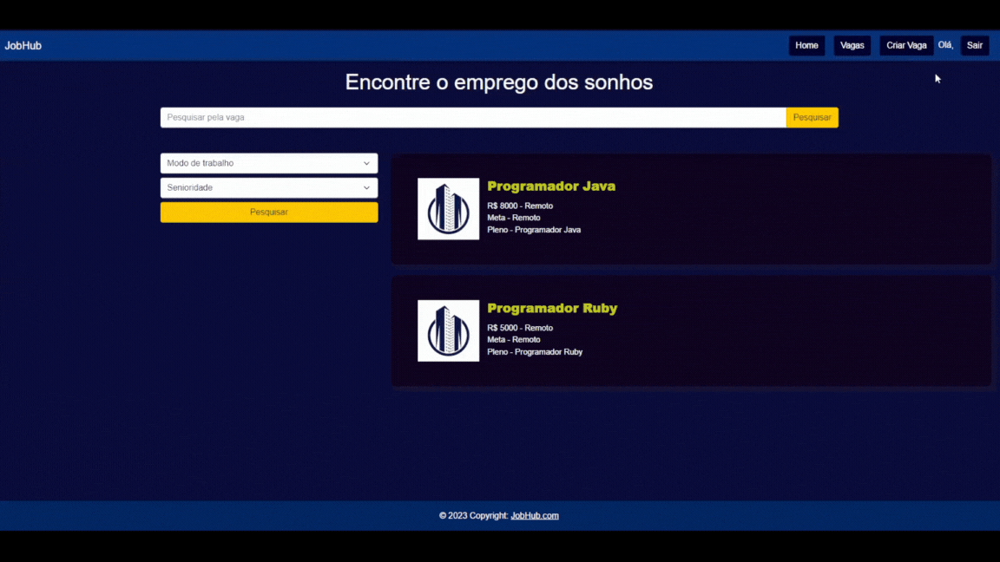

# Registro de Testes de Usabilidade

| **Caso de Teste** 	| **CT-01 – Fazer Cadastro** 	|
|:---:	|:---:	|
|	Objetivo do Teste 	| Verificar se o  usuário Candidato consegue se cadastrar de maneira satisfatória . |
| Referência 	|  |
| Avalição | - O usuário se cadastrou com sucesso |
|  	|  	|
| **Caso de Teste** 	| **CT-02 – Efetuar login**	|
| Objetivo do Teste 	| Verificar se o usuário consegue realizar login. |
| Referência 	|    |
| Avalição | - O usuário fez login com sucesso |
|  	|  	|
| **Caso de Teste** 	| **CT-03 – Personalizar Perfil**	|
| Objetivo do Teste 	| Verificar se o usuário consegue personalizar o perfil e adicionar seu currículo |
| Referência 	|  |
| Avalição | - O usuário personalizou o perfil com sucesso |
|  	|  	|
| **Caso de Teste** 	| **CT-04 – Aplicando para Vaga**	|
| Objetivo do Teste 	| Verificar se o usuário consegue pesquisar a vaga desejada e aplicar para ela de maneira satisfatória |
| Referência 	|  |
| Avalição | - O usuário aplicou para a vaga com sucesso |
|  	|  	|
| **Caso de Teste** 	| **CT-05 – Criação de Vaga**	|
| Objetivo do Teste 	| Verificar se o usuário Empresa consegue adcionar a vaga de emprego de maneira satisfatória |
| Referência 	|   |
| Avalição | - O usuário criou a vaga com sucesso |
|  	|  	|
